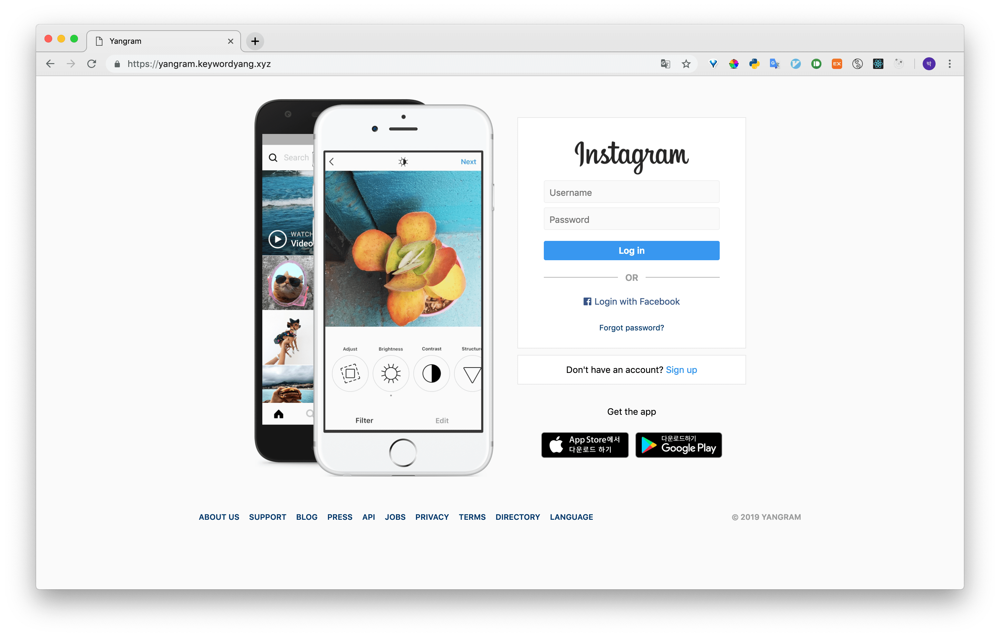
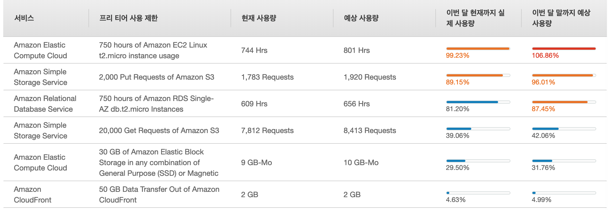

# yangram

Cloning Instagram with Python Django 

## Period

2019. 02

## Site

Link: [https://yangram.societyang.xyz](https://yangram.societyang.xyz)

## Libraries / Tools

Django, Mysql, React, Redux Ducks, Docker(nginx & gunicorn), AWS(EC2, ELB, CloudFront, Route53)

## History

#### First Deploy Elastic BeansTalk
###### Tools  
Elastic Beanstalk, ELB, CloudFront, Route53

###### Summary
[https://github.com/LuceteYang/TIL/blob/master/aws/django-elastic-beanstalk-deploy.md](https://github.com/LuceteYang/TIL/blob/master/aws/django-elastic-beanstalk-deploy.md)

## Excessive use
I am Free tier User  

#### Use Docker (I Try to reduce Expense)
###### Tools  
Docker(nginx & gunicorn), EC2, ELB, CloudFront, Route53  

###### Summary
[https://github.com/LuceteYang/django-docker-deploy](https://github.com/LuceteYang/django-docker-deploy)
